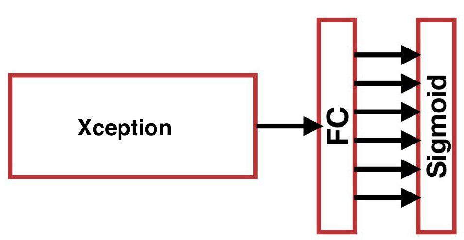
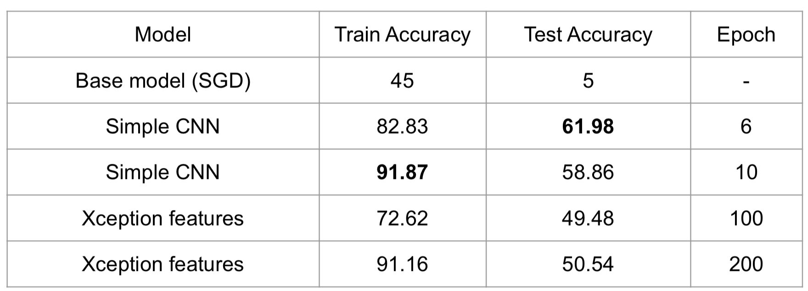

```{r setup, include=FALSE}
knitr::opts_chunk$set(echo = TRUE, eval=FALSE)
```

### Import the needed packages
```{python engine.path='/anaconda3/bin/python', message=FALSE, warning=FALSE}
import random
import shutil
import operator
import pandas as pd
import numpy as np
import matplotlib.pyplot as plt
# Simple CNN imports
import os
import time
import tensorflow as tf
from PIL import Image
from tensorflow.keras import datasets, layers, models
# Xception imports
from tensorflow.keras.applications import Xception
from tensorflow.keras.layers import GlobalAveragePooling2D
import tensorflow.contrib.eager as tfe
from matplotlib import pyplot as plt
```

### Sampling the Kaggle data set to create our data set
```{python engine.path='/anaconda3/bin/python', message=FALSE, warning=FALSE, eval=FALSE}
initial_train_path = 'train'
classes = os.listdir(initial_train_path)
classes_count = []
for c in classes:
    if c == ".DS_Store":
        continue
    images = os.listdir(os.path.join(initial_train_path, c))
    classes_count.append((c, len(images)))

classes_count = sorted(classes_count, key=lambda x: x[1], reverse=True)

selected_classes = classes_count[:20]
idx = 0
path = 'data'
for c, _ in selected_classes:
    images = os.listdir(os.path.join(initial_train_path, c))
    random.shuffle(images)
    os.mkdir(os.path.join(path, 'train', str(idx)))
    os.mkdir(os.path.join(path, 'test', str(idx)))
    train_size = int(selected_classes[-1][1] * 0.8)
    train_images = images[:selected_classes[-1][1]][:train_size]
    test_images = images[:selected_classes[-1][1]][train_size:]
    for img in train_images:
        shutil.copy(os.path.join(initial_train_path, c, img), os.path.join
        (path, 'train', str(idx), img))
    for img in test_images:
        shutil.copy(os.path.join(initial_train_path, c, img), os.path.join
        (path, 'test', str(idx), img))
    idx += 1
```

### Base Model:
#### Feature Extraction using HOG algorithm:

```{r}
setwd("/Users/yangmo/Desktop/proj5")
img_dir <- "./data/test/19/"
#source("http://bioconductor.org/biocLite.R")
#biocLite("EBImage")

feature_HOG<-function(img_dir){
  ### HOG: calculate the Histogram of Oriented Gradient for an image

  ### Input: a directory that contains images ready for processing
  ### Output: an .RData file contains features for the images

  ### load libraries

  library("EBImage")
  library("OpenImageR")

  dir_names <- list.files(img_dir)
  n_files <- length(dir_names)

  ### calculate HOG of images
  dat <- vector()
  for(i in 1:n_files){
    img <- readImage(paste0(img_dir,dir_names[i]))
    img<-rgb_2gray(img)
    dat<- rbind(dat,HOG(img))
  }

  ### output constructed features
  write.csv(dat, file="./output//HOGtest_19.csv")
  return(dat)
}

dat_HOG<-feature_HOG(img_dir)
```

### Training the Base model with SGD:
```{python engine.path='/anaconda3/bin/python', message=FALSE, warning=FALSE}
# -*- coding: utf-8 -*-
"""
Created on Sat Nov 30 20:16:15 2019
@author: tb2579
"""
from IPython import get_ipython
get_ipython().run_line_magic('matplotlib', 'inline')
import numpy as np
import matplotlib.pyplot as plt
import pprint
pp = pprint.PrettyPrinter(indent=4)
import cv2
import pandas
from skimage.feature import hog
from skimage.io import imread
from skimage.transform import rescale

 # Training - Using SGD (Stochastic Gradient Descent)
from sklearn.linear_model import SGDClassifier
from sklearn.model_selection import cross_val_predict
from sklearn.preprocessing import StandardScaler

train_df=pandas.read_csv('C:/Users/tb2579/Documents/MA Statistics/
Applied Data Analysis/Project 5/TrainFeatures.csv')
test_df=pandas.read_csv('C:/Users/tb2579/Documents/
MA Statistics/Applied Data Analysis/Project 5/TestFeatures.csv')

train_features=train_df.iloc[:,0:1152]
y_train=train_df["Label"]


sgd_clf = SGDClassifier(random_state=42, max_iter=1000, tol=1e-3)
sgd_clf.fit(train_features, y_train)

# Testing
test_features=test_df.iloc[:,0:1152]
y_test=test_df["Label"]

y_pred = sgd_clf.predict(test_features)
print(np.array(y_pred == y_test)[:25])
print('')
print('Percentage correct: ', 100*np.sum(y_pred == y_test)/len(y_test))


df = pandas.DataFrame(
    np.c_[y_test, y_pred],
    columns=['true_label', 'prediction']
)
df.head(20)
```

### Advance Model: Preparing the data set
```{python engine.path='/anaconda3/bin/python', message=FALSE, warning=FALSE}

train_img_path = 'data/train/'
test_img_path = 'data/test/'

train_set = []
for label in os.listdir(train_img_path):
    if label == ".DS_Store":
        continue
    for img in os.listdir(os.path.join(train_img_path, label)):
        if img == ".DS_Store":
            continue
        train_set.append((os.path.join(train_img_path, label, img), int(label)))

test_set = []
for label in os.listdir(test_img_path):
    if label == ".DS_Store":
        continue
    for img in os.listdir(os.path.join(test_img_path, label)):
        if img == ".DS_Store":
            continue
        test_set.append((os.path.join(test_img_path, label, img), int(label)))


train_imgs = []
train_labels = []
start_time = time.time()
for img, label in train_set:
    img = np.asarray(Image.open(img))
    train_imgs.append(img)
    train_labels.append(label)
print("--- %s seconds ---" % (time.time() - start_time))

test_imgs = []
test_labels = []
start_time = time.time()
for img, label in test_set:
    img = np.asarray(Image.open(img))
    test_imgs.append(img)
    test_labels.append(label)
print("--- %s seconds ---" % (time.time() - start_time))

```
### Simple CNN:


```{python engine.path='/anaconda3/bin/python', message=FALSE, warning=FALSE}
model = models.Sequential()
model.add(layers.Conv2D(128, (3, 3), activation='relu', input_shape=(128, 128, 3)))
model.add(layers.MaxPooling2D((2, 2)))
model.add(layers.Conv2D(64, (3, 3), activation='relu'))
model.add(layers.MaxPooling2D((2, 2)))
model.add(layers.Conv2D(32, (3, 3), activation='relu'))
model.add(layers.Flatten())
model.add(layers.Dense(32, activation='relu'))
model.add(layers.Dense(22, activation='softmax'))

model.compile(optimizer='adam', loss='sparse_categorical_crossentropy', 
metrics=['accuracy'])

history = model.fit(np.array(train_imgs), np.array(train_labels), 
epochs=10, shuffle=True, validation_data=(np.array(test_imgs), np.array(test_labels)))
```

### CNN With Xception feature extraction:




#### Extracting features with pre-trained Xception
```{python engine.path='/anaconda3/bin/python', message=FALSE, warning=FALSE}
class XceptionBottleneck(tf.keras.Model):

    def __init__(self):
        super(XceptionBottleneck, self).__init__()

        # Define xception layer (include_top=False and use imagenet weights),
        # see: https://keras.io/applications/#models-for-image-classification-
        with-weights-trained-on-imagenet
        self.xception_layers = Xception(weights='imagenet', include_top=False, 
        input_shape=(128, 128, 3))

        # Define pooling GlobalAveragePooling2D
        # see: https://keras.io/layers/pooling/
        self.pooling_layer = GlobalAveragePooling2D()

    def call(self, inputs):
        result = self.xception_layers(inputs)
        result = self.pooling_layer(result)
        return result


def cache_bottleneck_layers(numpy_data, batch_size, device):

    bottle_necks = []
    dataset = tf.data.Dataset.from_tensor_slices(numpy_data).batch(batch_size)
    n_samples = numpy_data.shape[0]

    with tf.device(device):
        xception_out = XceptionBottleneck()
        for batch_num, image in enumerate(dataset):
            print('\rComputing bottle neck layers... batch {} of {}'.
            format(batch_num+1, n_samples//batch_size), end="")

            result = xception_out(image)
            result = result.numpy()
            bottle_necks.append(result)

    return np.vstack(bottle_necks)


start_time = time.time()

# device = "gpu:0" if tfe.num_gpus() else "cpu:0"
device = "cpu:0"
bottle_necks = cache_bottleneck_layers(np.array(train_imgs, dtype=np.float32), 
batch_size=50, device=device)

print("--- %s seconds ---" % (time.time() - start_time))

cache_path = "data/cache/"
fname = 'bottle_neck_train.npz'
train_save_path = os.path.join(cache_path, fname)

if not os.path.isdir(cache_path):
    os.mkdir(cache_path)

np.savez(train_save_path, bottle_necks=bottle_necks, labels=np.array(train_labels))

start_time = time.time()

bottle_necks = cache_bottleneck_layers(np.array(test_imgs, dtype=np.float32), 
batch_size=50, device=device)

print("--- %s seconds ---" % (time.time() - start_time))

fname = 'bottle_neck_test.npz'
test_save_path = os.path.join(cache_path, fname)
np.savez(test_save_path, bottle_necks=bottle_necks, labels=np.array(test_labels))


```
#### Creating the 3-layer fully connected classifier 
```{python engine.path='/anaconda3/bin/python', message=FALSE, warning=FALSE}
class XceptionClassifier(tf.keras.Model):

    def __init__(self, n_classes):
        super(XceptionClassifier, self).__init__()
        # Define the layer(s) you would like to use for your classifier
        self.dense_layer_1 = tf.keras.layers.Dense(units=20*n_classes, 
        activation=tf.keras.activations.relu)
        self.dense_layer_2 = tf.keras.layers.Dense(units=5*n_classes, 
        activation=tf.keras.activations.relu)
        self.dense_layer_3 = tf.keras.layers.Dense(units=n_classes)

    def call(self, inputs):
        # Set this up appropriately, will depend on how many layers you choose
        result = self.dense_layer_1(inputs)
        result = self.dense_layer_2(result)
        result = self.dense_layer_3(result)
        return result

data = np.load(train_save_path)
train_bottle_necks, train_labels = data['bottle_necks'],  data['labels']

data = np.load(test_save_path)
test_bottle_necks, test_labels = data['bottle_necks'],  data['labels']

```
#### Training the classifier
```{python engine.path='/anaconda3/bin/python', message=FALSE, warning=FALSE}
batch_size = 16        # You will play around with this
n_epochs = 200         # Choose num epochs based on when you think the parameters have converged
learning_rate = 0.00001 # You will try different learning rates

train_loss_history = []

train_images_dataset = tf.data.Dataset.from_tensor_slices(train_bottle_necks)
train_labels_dataset = tf.data.Dataset.from_tensor_slices(train_labels)
train_dataset = tf.data.Dataset.zip((train_images_dataset, train_labels_dataset))
train_dataset = train_dataset.batch(batch_size).shuffle
(buffer_size=train_bottle_necks.shape[0])

x_classifier = XceptionClassifier(n_classes=20)
optimizer = tf.optimizers.Adam(learning_rate)

start_time = time.time()
with tf.device(device):
    for epoch in range(n_epochs):
        for batch, (images, labels) in enumerate(train_dataset):

            with tf.GradientTape() as tape:
                # Compute logits
                logits = x_classifier(images)
                xe_loss = tf.reduce_mean(tf.nn.sparse_softmax_cross_entropy_with_logits
                (labels=labels, logits=logits))

            train_loss_history.append(xe_loss.numpy())
            # Compute gradient and apply gradients
            grads = tape.gradient(xe_loss, x_classifier.variables)
            optimizer.apply_gradients(zip(grads, x_classifier.variables))
#                                       , global_step=tf.compat.v1.train.get_or_create_global_step())

            if batch % 10 == 0:
                print('\rEpoch: {}, Batch: {}, Loss: {}'.format(epoch, batch, 
                train_loss_history[-1]), end='')
print("--- %s seconds ---" % (time.time() - start_time))


```

#### Computing the train and test accuracies
```{python engine.path='/anaconda3/bin/python', message=FALSE, warning=FALSE}

logits = x_classifier(tf.constant(train_bottle_necks))
y_pred = tf.nn.softmax(logits).numpy()
train_pred = np.argmax(y_pred, axis=1)
train_accuracy = np.sum(train_pred == train_labels) / len(train_pred)

logits = x_classifier(tf.constant(test_bottle_necks))
y_pred = tf.nn.softmax(logits).numpy()
test_pred = np.argmax(y_pred, axis=1)
test_accuracy = np.sum(test_pred == test_labels) / len(test_pred)

print(train_accuracy, test_accuracy)

```

### Results : 

